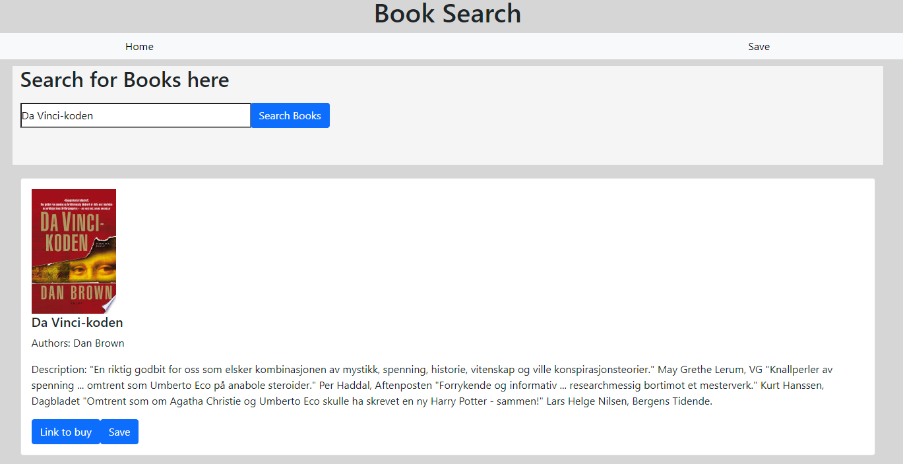

# Book Search App 
  

  
 *Book images are from the google books api   

  [Link to webpage](https://rocky-escarpment-73196.herokuapp.com/)
  
  This app is for searching and saving you favorite/read Books 
    
  ## Table of Content
  [-Installation](#Installation)  
  [-Description](#Description)    
  [-Usage](#Usage)  
  [-Questions](#Questions)  
  
  
  ## Installation  
  The user requires Robo 3T to host local NO-SQL database. After the user has npm installed all the modules, the user requires an API key from google books api. After the user has recieved the API key, create a .env file in the src folder and use "REACT_APP_API_KEY = (Users api key)". Then the user can write npm start in the terminal to run the app locally.

  ## Description  
  This project uses google book api to search for books relevent to the users search term. The search "cards" the user recieves has to buttons, one directs the users to the google book link, the other to save the book to the users saved book list which is a NO-SQL database (mongo), it will only save the users book if the book is not in the list. The saved page also has a delete button for removing the book from the saved list.

  ## Usage  
  This project is used find books for the user and save the users favorite/read books.
  
  ## Questions?  
  
    My Github link is [NVrtis](https://github.com/NVrtis)
    Any futher questions can be sent to my email here  <Nvav91@gmail.com>

  
 
  
  